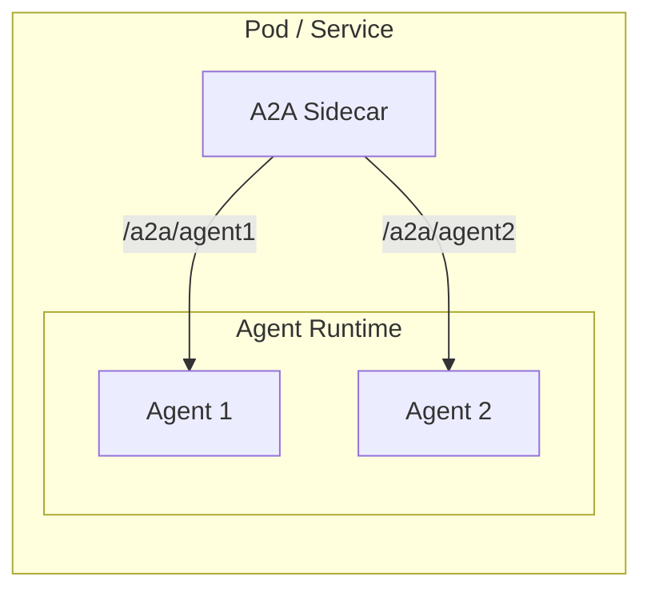

# A2A Sidecar

A lightweight proxy that wraps non-A2A-compliant agents, translating between the A2A protocol and the agent's native HTTP API.



## Configuration

Configuration is passed via environment variables. Agent cards are defined as a JSON array.

| Variable          | Required | Description                            |
| ----------------- | -------- | -------------------------------------- |
| `AGENTCARDS`      | Yes      | JSON array of agent configurations     |
| `PORT`            | No       | Sidecar listen port (default: 8080)    |
| `TIMEOUT_SECONDS` | No       | Request timeout (default: 300)         |
| `MAX_CONCURRENT`  | No       | Max concurrent requests (default: 100) |

**Agent configuration schema:**

```json
[
  {
    "card": { /* Full AgentCard per A2A spec */ },
  },
  {
    "card": { /* Full AgentCard per A2A spec */ },
  },
  ...
]
```

**Example:**

```bash
AGENTCARDS='[
  {
    "card": {
      "name": "image_scoring",
      "description": "Agent that generates images and scores their adherence to the prompt.",
      "url": "http://localhost:8080/a2a/image_scoring",
      "version": "1.0.0",
      "defaultInputModes": ["text/plain"],
      "defaultOutputModes": ["image/png", "text/plain"],
      "capabilities": {
        "streaming": true
      },
      "skills": [
        {
          "id": "generate_and_score_image",
          "name": "Generate and Score Image",
          "description": "Generates an image from a text prompt and scores adherence.",
          "tags": ["image generation", "image scoring"],
          "examples": ["Generate an image of a futuristic city at sunset"]
        }
      ]
    }
  },
  {
    "card": {
      "name": "code_assistant",
      "description": "Agent that helps with code generation and review.",
      "url": "http://localhost:8080/a2a/code_assistant",
      "version": "1.0.0",
      "defaultInputModes": ["text/plain"],
      "defaultOutputModes": ["text/plain"],
      "capabilities": {
        "streaming": true
      },
      "skills": [
        {
          "id": "code_review",
          "name": "Code Review",
          "description": "Reviews code for bugs, style issues, and improvements.",
          "tags": ["code", "review", "programming"],
          "examples": ["Review this Python function for bugs"]
        }
      ]
    }
  }
]'
```

## Usage

```bash
# Get agent card (query parameter approach)
curl "http://localhost:8080/.well-known/agent.json?agent_id=image_scoring"

# Send message to agent
curl -X POST "http://localhost:8080/a2a/image_scoring" \
  -H "Content-Type: application/json" \
  -d '{"jsonrpc":"2.0","method":"message/send","params":{"message":{"role":"user","parts":[{"kind":"text","text":"Generate an image of a sunset"}]}},"id":1}'
```
