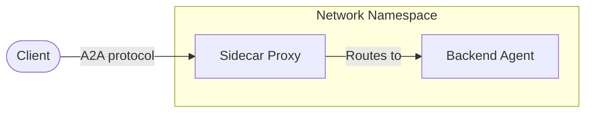

# A2A Sidecar

A lightweight proxy that translates between the A2A protocol and the agent's native HTTP API.



## Supported Agent Types

The sidecar supports different backend agent types:

| Type | Value           | Streaming | Description                           |
| ---- | --------------- | --------- | ------------------------------------- |
| A2A  | `a2a` (default) | Yes       | Backend natively speaks A2A protocol. |

## Configuration

Configuration is passed via environment variables.

| Variable          | Required | Default | Description                    |
| ----------------- | -------- | ------- | ------------------------------ |
| `AGENTCARD`       | Yes      | -       | Agent card JSON (per A2A spec) |
| `PORT`            | No       | 8080    | Sidecar listen port            |
| `AGENT_TYPE`      | No       | `a2a`   | Agent type: `a2a`, `adk`       |
| `TIMEOUT_SECONDS` | No       | 300     | Request timeout                |
| `MAX_CONCURRENT`  | No       | 100     | Max concurrent requests        |

### Example

```bash
export AGENTCARD='{
  "name": "image_scoring",
  "description": "Agent that generates images and scores their adherence to the prompt.",
  "url": "http://localhost:8080/a2a/image_scoring",
  "version": "1.0.0",
  "defaultInputModes": ["text/plain"],
  "defaultOutputModes": ["image/png", "text/plain"],
  "capabilities": {
    "streaming": true
  },
  "skills": [
    {
      "id": "generate_and_score_image",
      "name": "Generate and Score Image",
      "description": "Generates an image from a text prompt and scores adherence.",
      "tags": ["image generation", "image scoring"],
      "examples": ["Generate an image of a futuristic city at sunset"]
    }
  ]
}'
```
